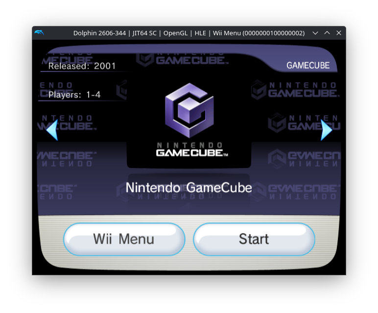
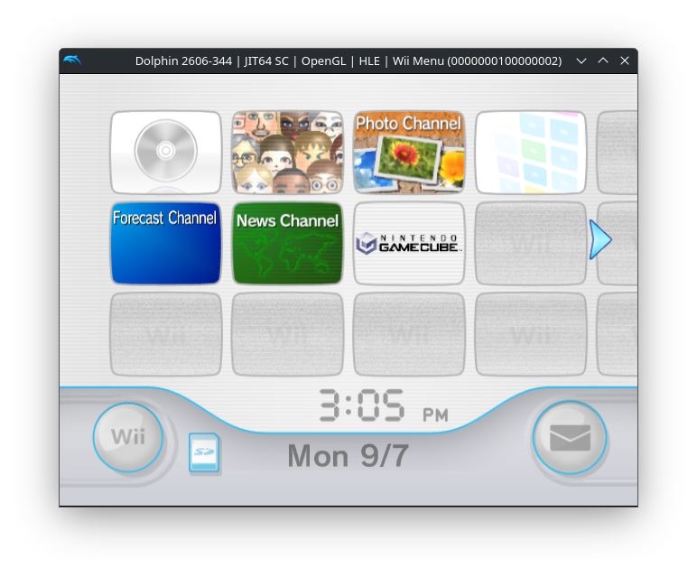

# GC⚡VC

GC⚡VC is a helper application that allows you to create Virtual Console-style banners for the GameCube games saved on your homebrewed Wii.

It produces banner and icon elements that, when injected into an existing Virtual Console WAD, fit right in with the stock system menu.

When combined with the appropriate forwarder for your USB loader of choice, it offers the opportunity to create sleek single ISO loaders for your GameCube games. The game title, release year, and player count are all fully customizable. Patches are also provided to produce placeholder "GameCube logo" assets for the title screen thumbnail in both the banner and icon.

GC⚡VC itself is written entirely in Python and intended to be cross-platform. However, full integration of the produced assets into a packed WAD is not currently implemented. Instructions are therefore provided to do so using CustomizeMii which, while not a cross-platform application, should run fine for Linux users under WINE. See "Initial Setup" for more information.

## Requirements

The following are required to create a fully working banner with GC⚡VC:

* [Python](https://www.python.org/downloads/) >= 3.13.5
    * Older versions of Python 3 may work, but are unsupported.
* F-Zero (USA) (SNES) (Virtual Console).wad
    * Or its assets, see "Initial Setup".
* [CustomizeMii v3.11](https://storage.googleapis.com/google-code-archive-downloads/v2/code.google.com/customizemii/CustomizeMii%203.11.rar)
    * Optional; Used only by the user to extract assets from the donor WAD and replace them with GC⚡VC's output.

Ensuring that your F-Zero WAD has the following SHA256 hash is recommended, but not required:

> fda4a7e4b812e44fde814badc777b23441fc10afda870f2417759d9b987aa08a

GC⚡VC checks the hashes of the assets extracted from your WAD automatically. Therefore, if your WAD contains intact TPL and banner assets but is modified in other places, it may still be valid.

### Why do I need a WAD?

GC⚡VC does not directly create files containing copyrighted intellectual property. Instead, it applies patches to the assets extracted from your WAD and subsequently modifies that output. Your provided assets must therefore match the intended input files exactly, or else the binary mask applied to them will not produce anything useful.

## First-Time Setup

The following steps are required to set up GC⚡VC for the first time, but do not need to be followed again once setup is complete.

### Preparing your assets

GC⚡VC requires specific assets to be extracted from the donor WAD and sorted into specific files.

#### Extracting assets from your WAD with CustomizeMii

Users with previously extracted assets may skip this step.

1) Install CustomizeMii (and any relevant dependencies) on your system, then run CustomizeMii.exe. Linux users may do so using WINE. In developer testing, no issues were encountered when running CustomizeMii through a compatibility layer.
2) Under the "Source" tab of CustomizeMii, select "Browse" next to the "Source Wad:" field. Locate and open your WAD.
3) Under the "Banner" tab, do the following for "my_BackSNES_a.tpl" and "VCPic.tpl":
    1) Click on the file in the list to highlight it.
    2) Select "Extract" and save the PNG to your machine. Do not rename the file.
4) Under the "Icon" tab, follow steps 3.1 and 3.2 for "IconVCPic.tpl" and "LogoSNES.tpl".
5) Under the "Layout" tab, select "banner.brlyt", then "Extract", and save the layout to your machine. Do not rename the file.

Your assets should now be extracted. You may close CustomizeMii.

#### A note about PNGs

In developer testing, CustomizeMii appeared to consistently produce PNGs with the same hashes each time the TPL assets listed above were extracted. However, differences in how platforms or operating systems handle the extraction process could theoretically result in PNGs being produced that GC⚡VC will not recognize as valid. If this occurs, GC⚡VC may need to be patched to first convert the PNGs to a bitmap format before they are used.

Testing of this behavior from Windows and MacOS users would be appreciated.

If you follow the above steps completely with a known-good WAD and find that your assets are being rejected for having incorrect hashes, please refer to "Troubleshooting & Reporting Problems" and file an issue on GitHub. Be sure to include your operating system name and version in your report.

### Sorting your assets

GC⚡VC comes with a predefined file structure which should not be modified in any way. The folders "in", "out", and "patches" each have specific uses. Do not rename these folders.

Extract GC⚡VC to any accessible location on your system and open its location. Place your assets in the "in" folder according to where they were extracted from:

* Place "my_BackSNES_a.png" and "VCPic.png" in "in/banner"
* Place "IconVCPic.png" and "LogoSNES.png" in "in/icon"
* Place "banner.brlyt" in "in", next to "banner" and "icon"

Your assets are now ready for use. You may reuse these assets multiple times without following these setup steps again.

## Usage

GC⚡VC must be run in the same directory where it is saved. To run the application, open its location in a terminal or command prompt window, then run the following:

> `python3 gcvc.py`

(Replace python3 with the path to your python binary, if needed.)

The application will walk you through the patching process via on-screen prompts. Please read each option before proceeding.

Once your modified files are saved, they will be available in the "out" directory.

The files "out/banner/VCPic.png" and "out/icon/IconVCPic.png" are placeholder assets intended to be modified to your liking. However, they may also be used as-is if you so choose.

### Injecting output assets wtih CustomizeMii

To apply your assets to a WAD, you must inject them using CustomizeMii:

1) Run CustomizeMii.exe as described in "Extracting assets from your WAD with CustomizeMii".
2) Under the "Source" tab, select "Browse" next to "Source Wad:" and open any installable Wii WAD. 
3) Under the "Banner" tab, do the following for "my_BackSNES_a.tpl" and "VCPic.tpl":
    1) Click on the file in the list to highlight it.
    2) Select "Replace", then open the PNG file of the same name in GC⚡VC's "out/banner" directory.
4) Under the "Icon" tab, follow steps 3.1 and 3.2 for "IconVCPic.tpl" and "LogoSNES.tpl", replacing each with its counterpart in GC⚡VC's "out/icon" directory.
5) Under the "Layout" tab, select "banner.brlyt", then "Replace", and open the patched "banner.brlyt" from GC⚡VC's "out" directory.
6) (Optional) Under the "Title" tab, specify the title that you would like to appear when you hover over the channel on the Wii Menu. You may also specify a Title ID under the "Options" tab.
7) Click on "Create WAD", or "Send WAD" if that's what you want to do. You will be asked whether you are sure that you want to modify the brlyt without modifying the brlan. This is normal. Select "Yes", then save your output WAD.

Your WAD is now ready to be installed or modified with an updated DOL.

### Creating a single-ISO forwarder

In order to replace the actual functionality of your output WAD once it is launched, you will need to replace its DOL.

For USBLoaderGX, this may be accomplished by downloading [GXForwarder.dol](https://github.com/modmii/WiiGSC/blob/main/crapwii/Crap/WiiGCC/Loaders/GXForwarder.dol) and modifying addresses 0003EA98 - 0003EA9D. By default, these will say "CRAPPY". Replace them with your target game's ID (e.g. GALE01 for SSBM) then inject the DOL into your WAD using CustomizeMii.

If you are familiar with how to do this for WiiFlow Lite, please modify this paragraph explaining how and file a pull request.

Additional functionality may be added to GC⚡VC to allow it to do this for you in the future.

## Troubleshooting & Reporting Problems

GC⚡VC will generally report any problems to the user and exit for safety instead of throwing an unhandled exception. However, situations could arise where internal logic errors occur. If this happens, enabling debugging messages may help to solve the problem.

To enable debug messages, run the following:

> `python3 gcvc.py --debug`

If you experience a crash that you are unable to fix by following the on-screen instructions, please file an issue on GitHub. In your report, please include the full output produced when running the application with debug messages enabled.

## Contributing

Contributions are welcome in all forms, including testing, documentation, and code.

Code enhancements may be contributed through GitHub pull requests. When filing a PR, please be sure to not include any copyrighted assets (i.e. most/all of the "in" or "out" folders) in your commits. Please make your pull request appropriately descriptive for the changes that you made, explaining what you changed, why you changed it, and what the resulting change in behavior is.

Version increments and releases will be made with maintainer discretion when appropriate.

Code assistance using AI tools is permitted, but contributors are expected to be able to justify their changes. "Vibe coded" or spammy PRs without consideration for code integrity will be ignored.

## Thank Yous

This project stands on the shoulders of the giants that worked to make the Wii modding scene what it is today. Among them, special thanks must be given to:

* The entire [GBAtemp](https://gbatemp.net/) community for their continued support of the scene. In particular:
    * [CatmanFan](https://gbatemp.net/members/catmanfan.398221/) and [SaulFabre](https://gbatemp.net/members/saulfabre.479192/), whose single ROM loader projects inspired this whole thing.
    * [XFlak](https://gbatemp.net/members/xflak.198223/), for ModMii and everything that surrounds it.
    * [Plaxaris92](https://gbatemp.net/members/plaxaris92.700833/), for motivating me to revisit this project after it sat on my hard drive for two and a half years.
* The [Dolphin Emulator](https://dolphin-emu.org/) community for making bricking a NAND a low-stakes affair.
* [The Custom Mario Kart Wiiki](https://mkwiiki.org/wiki/Main_Page) for their BRLYT documentation.
